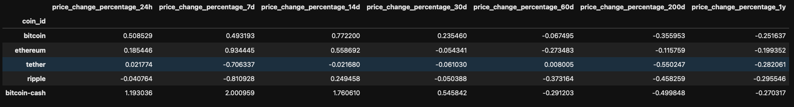
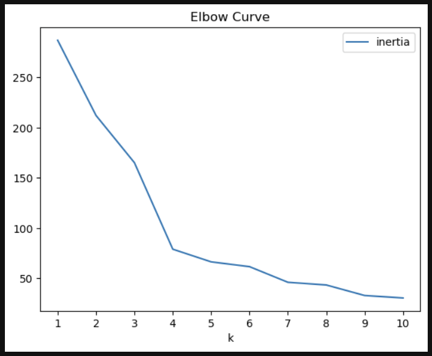
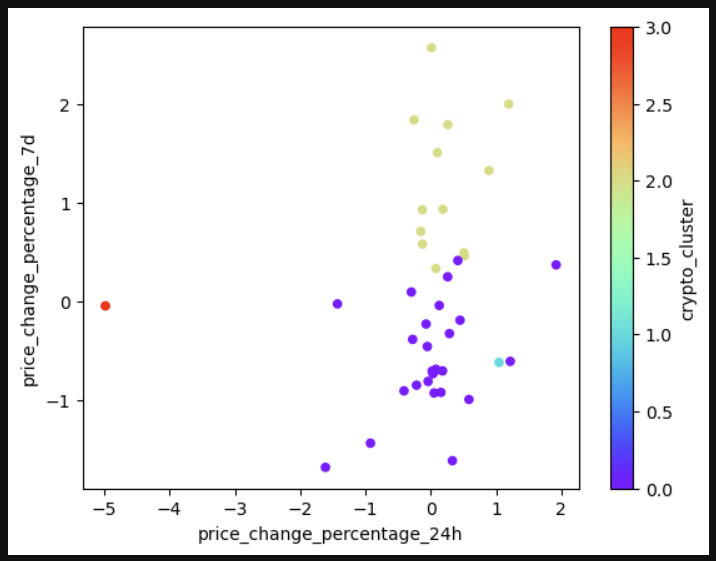
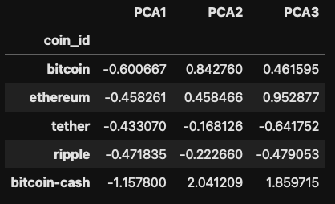
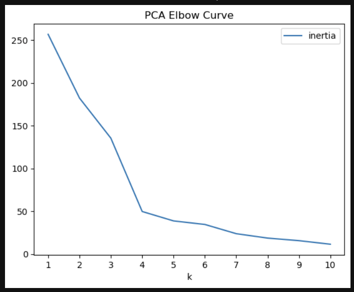
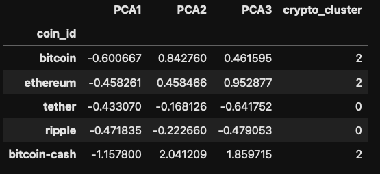
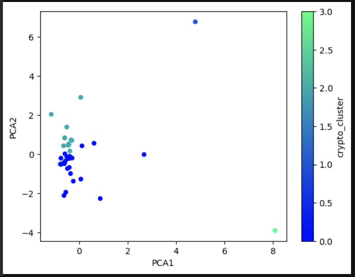
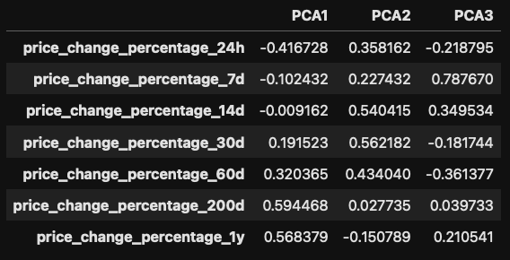
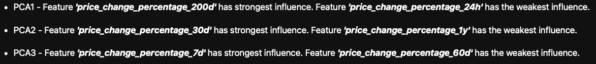

# Crypto Clustering 

In this "Unsupervised Learning" challenge K-means algorithm and Principal Component Analysis (PCA) is used to classify crypto currencies price fluctuations across various timeframes. Specifically, it will examine price changes over intervals spanning 24 hours, 7 days, 30 days, 60 days, 200 days, and 1 year.

It will use ***StandardScalar()*** module from ***scikit-learn*** to Standardize features from CSV file by removing the mean and scaling to unit variance.  
  
Then it will get the best K value for using the original scaled dataframe. This will be done by drawing an Elbow Curve (line chart of KMeans inertia values for cluster size from 1 to 10). In this example optimal cluster size seems to be 4.  
  
Using KMeans model it will then get predicted cluster values for original scaled dataframe. 

A clusters plot will used to identify clusters of dataset.  
  

Then original number of features in original dataframe will be optimized. This is done by creating a PCA model instance and performing **fit_transform** method on scaled dataframe. This will return a dataframe with specified number of columns(features). In this example we will be creating three columns (n_components=3). Then that array will be converted into a DataFrame and **coin_id** will be set as an index.  
  

For the above PCA optimized dataframe we will find the best k values. This will be done by drawing an Elbow Curve (line chart of KMeans inertia values for cluster size from 1 to 10). In this example optimal cluster size appears to be 4.  
  

Clustering of Cryptocurrencies dataset will be done by K-Means algorithm using the PCA Data frame  
  

Create scatter plot of PCA1 vs PCA2 data  

Then weights of each feature on each Prinical Component will be determioned.  
  
  

